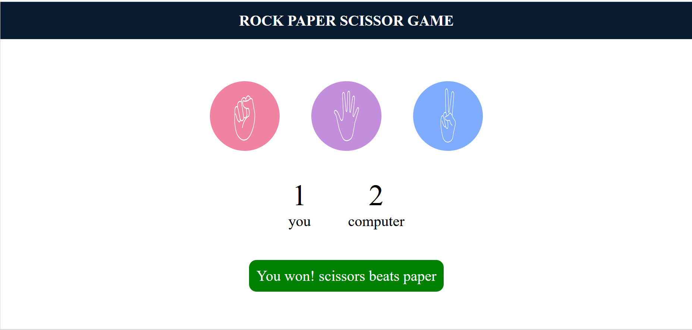
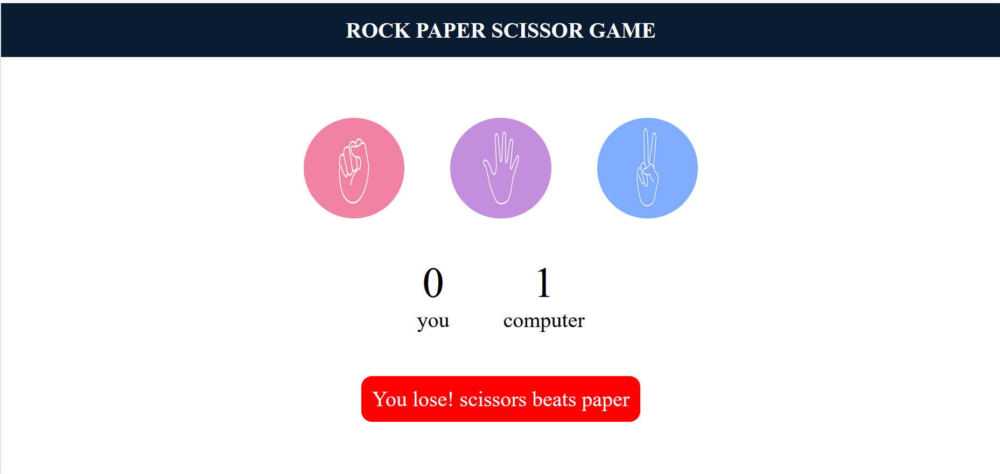
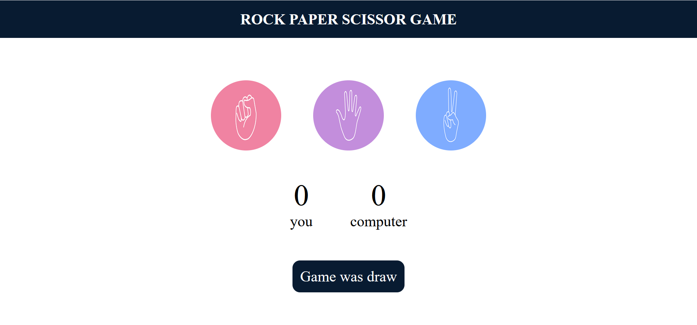

# ✂️🪨📄 Rock Paper Scissors Game

A fun and simple **Rock Paper Scissors** game built with **HTML, CSS, and JavaScript**.  
Play against the computer and see who comes out on top! 💻🎮

## 📑 Table of Contents
1. [🎯 Features](#-features)
2. [🖼 Screenshots](#-screenshots)
3. [⚡ How to Play](#-how-to-play)
4. [🛠 Tech Used](#-tech-used)

## 🎯 Features
- 👤 Clickable buttons for **Rock, Paper, or Scissors**  
- 🤖 The computer randomly chooses its move  
- 🏆 Shows **win, lose, or draw** messages instantly  
- 💯 Keeps track of **user and computer scores**  
- 🎨 Color-coded messages for easy feedback

## 🖼 Screenshots

**Game Interface**  
  
*Figure 1: Main game interface with scores displayed.*

**Winning Round**  
  
*Figure 2: User wins this round.* 🟢

**Losing Round**  
  
*Figure 3: User loses this round.* 🔴

**Draw Round**  
  
*Figure 4: This round ended in a draw.* 🔵

## ⚡ How to Play
1. Clone or download this repository.  
2. Open `index.html` in your favorite web browser. 🌐  
3. Click on **Rock, Paper, or Scissors** to make your move.  
4. Watch the **score update** and see the result message after each round.  

## 🛠 Tech Used
- 💻 HTML  
- 🎨 CSS  
- 📝 JavaScript  

## 💡 Notes
- Scores for both the **user and the computer** update dynamically after each round.  
- The result message changes color for clarity:  
  - 🟢 Green → You win!  
  - 🔴 Red → You lose!  
  - 🔵 Dark Blue → Draw!
